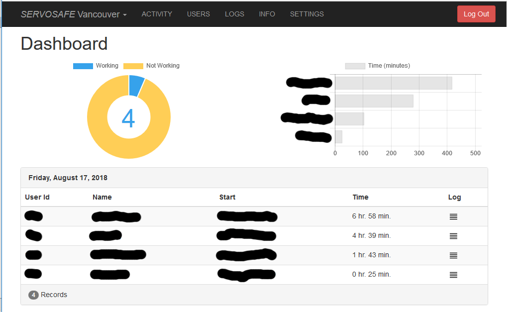
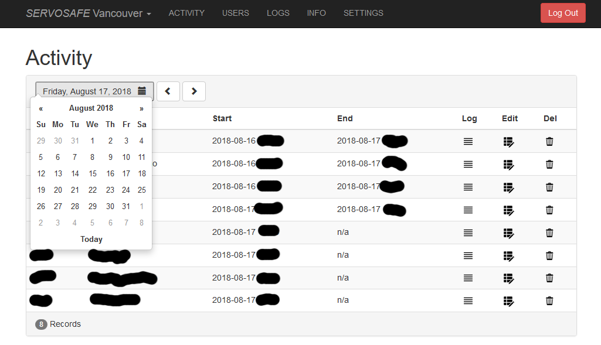
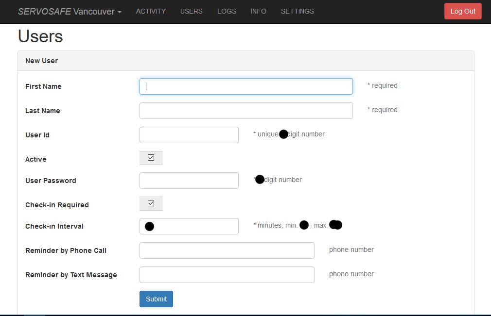

# Application for Hybrid Web Application Developer

Thank you for following the link here.

## Most recent personal project

Four days ago I wrote a short post about how to build an application which can be used to send text messages from a desktop computer to mobile phones. It's simple but it's practical and it demonstrates how I was able to:
- find a compiler to produce cross-platform (Windows, macOS, Linux), stand-alone (portable) executables
- setting up a toolchain 
- interact with a cloud API including authentication
- understand and write code in a new language
- write instructions about how to build it

Here is a screenshot of the application (macOS):

And here is the link to my post (includes source code): (https://bit.ly/2nDxmHo)

## An interesting personal project that I designed and build (Servosafe)

Servosafe (https://www.servosafe.com) is 100% my contribution and is an automated phone-based check-in system. Workers sign in at the beginning of the shift, periodically check-in, sign off at the end of the shift. If a worker fails to check-in, Servosafe will alert the worker's supervisor.

The front-end is a website built with:
- HTML, CSS, JavaScript
- jQuery, Chart.js and Bootstrap
- Moment.js and Pusher.com

The back-end is built with:
- Virtual private server (Ubuntu Linux) from DigitalOcean
- Communication services and API from Twilio
- OpenBD (ColdFusion application server) and Node.js (for Pusher.com interaction)

The source code is private but I'm willing to show it at an interview, here are some screenshots of the responsive web interface:

### Dashboard

### Activity

### New User

## Stack Overflow contribution

I have over 200 answers on Stack Overflow (top 5% ColdFusion, top 5% Twilio API, top 10% JavaScript) and the link to my profile is this (https://bit.ly/2L7UTdy)

### Some of my answers
- [Send a value from PHP to Node JS for execution](https://stackoverflow.com/questions/51775525/send-a-value-from-php-to-node-js-for-execution/51779756#51779756)
- [How does this javascript class and method work?](https://stackoverflow.com/questions/51369057/how-does-this-javascript-class-and-method-work/51370098#51370098)
- [Why is Twilio and Firebase not working cohesively using Node.js?](https://stackoverflow.com/questions/50182368/why-is-twilio-and-firebase-not-working-cohesively-using-node-js/50186208#50186208)
- [Receiving and processing an SMS with Twilio in Python](https://stackoverflow.com/questions/50075375/receiving-and-processing-an-sms-with-twilio-in-python/50082747#50082747)
- [chart.js: hide specific ticks in y-axis and hide all x-axis grid line](https://stackoverflow.com/questions/37363567/chart-js-hide-specific-ticks-in-y-axis-and-hide-all-x-axis-grid-line/37366173#37366173)

## Thank you for your time

