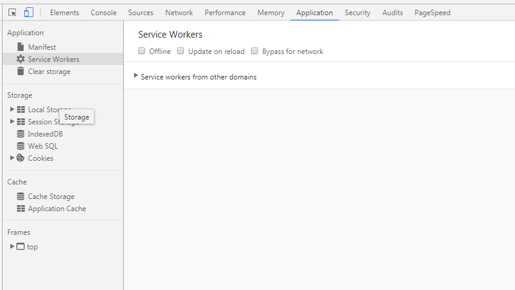

# Our First Service Worker Project

## Getting Started
* Install Visual Studio Code
* Install the ***Live Server*** extension for VS Code (https://marketplace.visualstudio.com/items?itemName=ritwickdey.LiveServer)

### Read
Using Service Workers (https://developer.mozilla.org/en-US/docs/Web/API/Service_Worker_API/Using_Service_Workers)

### Folders and Files
``` bat
cd /
cd apps
mkdir ServiceWorkerHello
cd ServiceWorkerHello
mkdir src
mkdir dist
cd src
touch index.html app.js sw.js
code .
```

### index.html

``` html
<!DOCTYPE html>
<html lang="en">
<head>
    <meta charset="UTF-8">
    <meta name="viewport" content="width=device-width, initial-scale=1.0">
    <meta http-equiv="X-UA-Compatible" content="ie=edge">
    <title>Service Worker Hello</title>
</head>
<body>
    <h1>Service Worker Hello</h1>
    <hr />
    
    <script src="app.js"></script>
</body>
</html>

```

### app.js

``` js
// app code goes here

```

### sw.js

``` js
// service worker code goes here

```

### Next
* Start Live Server with ***Go Live*** from Visual Studio Code taskbar
* The browser will open at *http://127.0.0.1:5500/index.html*
* Open Chrome Dev Tools (Ctrl+Shift+I)
* Click on ***Application*** tab, next on ***Service Workers***




